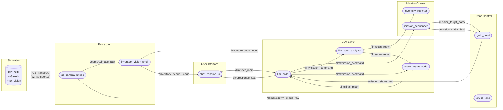

# System Architecture

```mermaid
graph LR
    subgraph USER["User Interface"]
        UI([chat_mission_ui])
    end

    subgraph LLM_LAYER["LLM Layer"]
        LLM([llm_node])
        ANALYZER([llm_scan_analyzer])
        REPORT([result_report_node])
    end

    subgraph MISSION["Mission Control"]
        SEQ([mission_sequencer])
        INV_REP([inventory_reporter])
    end

    subgraph DRONE["Drone Control"]
        GOTO([goto_point])
        ARUCO([aruco_land])
    end

    subgraph PERCEPTION["Perception"]
        BRIDGE([gz_camera_bridge])
        VISION([inventory_vision_shelf])
    end

    subgraph SIM["Simulation"]
        GZ[("PX4 SITL\n+ Gazebo\n+ px4vision")]
    end

    UI -->|/llm/user_input| LLM
    LLM -->|/llm/response_text| UI
    LLM -->|/llm/mission_command| SEQ
    LLM -->|/llm/mission_command| ANALYZER
    LLM -->|/llm/mission_command| REPORT

    SEQ -->|/mission_target_name| GOTO
    GOTO -->|/mission_status_text| LLM
    GOTO -->|/mission_status_text| SEQ

    GZ -->|"GZ Transport\n(gz-transport13)"| BRIDGE
    BRIDGE -->|/camera/image_raw| VISION
    BRIDGE -->|/camera/down_image_raw| ARUCO

    VISION -->|/inventory_scan_result| ANALYZER
    VISION -->|/inventory_debug_image| UI

    ANALYZER -->|/llm/scan_report| INV_REP
    ANALYZER -->|/llm/scan_report| REPORT

    REPORT -->|/llm/final_report| LLM
```
